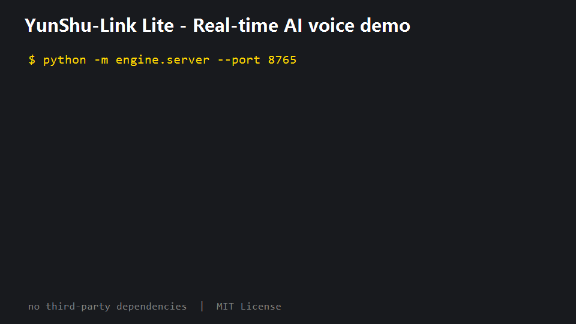
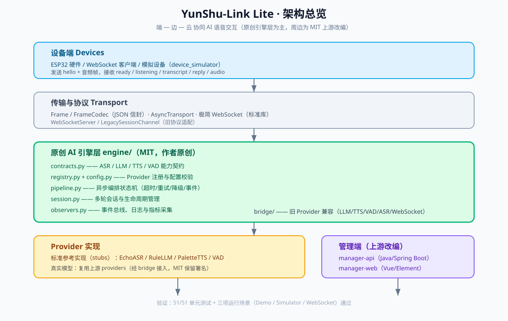

# YunShu-Link（云枢）· 个人精简改编版


## 项目亮点

- **端—边—云协同**：ESP32/客户端 → 实时 WebSocket → 可插拔 AI 引擎 → 设备响应。
- **原创 AI 引擎层**：能力契约、Provider 注册、异步编排状态机、会话管理、
  事件总线、指标采集，全部仅依赖 Python 标准库。
- **可插拔模型**：ASR / LLM / TTS / VAD 配置热切换，兼容云端与本地模型。
- **真实网络服务**：零第三方依赖启动 WebSocket 服务，设备协议即可接入。
- **工程质量**：51/51 单元测试 + 三项运行场景，GitHub Actions 持续验证。
- **开源许可**：MIT，保留上游署名，可自由使用、修改、商用。





一套面向 ESP32 智能硬件的「端—边—云」协同 AI 语音交互平台。本目录是原开源项目
[KingYeon-Zoo/YunShu-Link](https://github.com/KingYeon-Zoo/YunShu-Link)（MIT License）的
**裁剪改编版本**，保留最核心的「语音 AI + 设备管理」主线，移除移动端、数字人演示工具与竞赛素材，
用于个人学习与练习。

## 来源与许可

- 上游项目：`KingYeon-Zoo/YunShu-Link`（MIT）
- 更上游衍生来源：`xinnan-tech/xiaozhi-esp32-server`（MIT）
- 本目录保留原始 `LICENSE`、版权声明与来源说明。按照 MIT 许可要求，如对外分发、公开或求职展示，
  请保留本文件与 `LICENSE`，不要移除上游署名。

## 保留的核心模块

| 子系统 | 目录 | 技术栈 | 职责 |
| --- | --- | --- | --- |
| 语音核心服务 | `main/xiaozhi-server` | Python 3.10 · asyncio | 流式 ASR → 大模型 → TTS → 设备动作 |
| 原创 AI 引擎层 | `main/xiaozhi-server/engine` | Python 3.10+ · 标准库 | 能力契约、Provider 注册、异步编排状态机 |
| 管理后端 | `main/manager-api` | Java 21 · Spring Boot | 用户 / 设备 / 智能体配置、鉴权、OTA |
| 管理 Web | `main/manager-web` | Vue 2 · Element UI | Web 管理控制台 |
| 部署 | `start-dev.sh`、`docker-setup.sh`、`docker-compose*.yml` | Docker / 脚本 | 一键开发与容器化运行 |

> `engine/` 为作者原创实现；除该目录外，其余子系统基于上游开源项目
> （MIT）改编，具体来源见下方说明。

## 调整内容

- 移除：`main/manager-mobile`（uni-app 移动端）、`main/digital-human`（数字人工具）、
  `main/manager-web/public/generator`（前端数字人大资源）、演示截图、竞赛材料与原项目介绍类文档。
- 保留：全部代码、部署与集成类功能文档（见 `docs/README.md`）。
- 被移除内容统一存放在 `../.archive_yunshu_link/`，需要时可恢复。

## 快速开始（最简形态）

```bash
cd main/xiaozhi-server
conda create -n yunshu-link python=3.10 -y
conda activate yunshu-link
pip install -r requirements.txt
python app.py   # WebSocket :8000, HTTP :8003
```

配置说明：

- 已生成 `main/xiaozhi-server/data/.config.yaml`（从 `config.yaml` 复制），是服务启动必需配置。
- 默认 `selected_module` 已使用本地/免费组合：FunASR（本地 ASR）、EdgeTTS（免费 TTS）、
  SileroVAD（本地 VAD）、ChatGLMLLM（智谱免费档，需在 https://bigmodel.cn 领取 Key）。
- 如需完全本地化，可将 LLM 切换为 Ollama。首次启动会自动下载部分语音模型，需安装系统级 `ffmpeg`。

叠加管理后台：

```bash
cd main/manager-api && mvn spring-boot:run          # :8002
cd main/manager-web && npm install && npm run serve  # :8001
```

## 文档导航

- 技术结构与学习路径：[main/README.md](main/README.md)
- 功能文档索引：[docs/README.md](docs/README.md)
- AI 引擎层原创设计文档：[main/xiaozhi-server/engine/README.md](main/xiaozhi-server/engine/README.md)
- 运行与测试报告：[docs/RUNNING_AND_TESTS.md](docs/RUNNING_AND_TESTS.md)
- 参与贡献：[CONTRIBUTING.md](CONTRIBUTING.md) · 安全说明：[SECURITY.md](SECURITY.md)
- 部署与集成指南保留在 `docs/` 下（Docker、固件、MCP、RAGFlow、声纹、OTA 等）。

## 引擎层快速验证

```bash
cd main/xiaozhi-server
python -m engine.check
python -m engine
python -m engine.device_simulator
python -m engine.server --port 8765
python -m engine.server --client --port 8765
python -m unittest discover -s engine/tests -t . -v
```

当前自检结果：**51/51 单元测试通过**，三项运行场景（端到端演示、
模拟设备协议、真实 WebSocket 服务）全部 PASS。

## 说明

- 本项目为学习用途的二次改编，未经安全评测，不建议直接用于生产环境。
- 端到端真实语音体验需要 ESP32 客户端或对应的 WebSocket 客户端接入。
